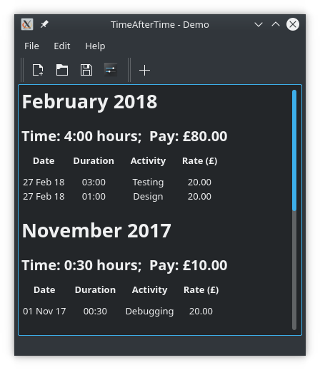
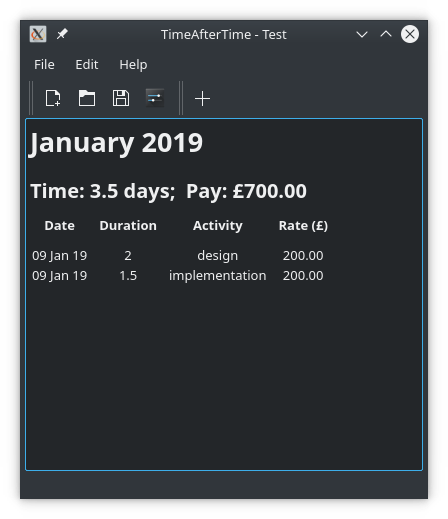
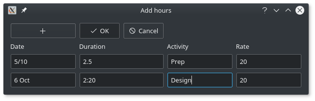

# TimeAfterTime - Timesheet editor

(C) Keziah Milligan, 2017
GPL v3. See https://www.gnu.org/licenses/gpl-3.0.en.html

## What is it?
TimeAfterTime allows you to create and manage timesheets. 

 

## What do I need?
* Python3
* PyQt5

## How do I use it?
You can create a blank timesheet with File > New or Crtl+N. 
You'll be asked to set a name and a default pay info, including 
currency, time base (day or hour) and amount. 
You can then add entries to the timesheet. The `date` field will
take any reasonable date string (in day-month-year order) and, 
if given incomplete information, will assume the current 
date/month/year/century. 
If the selected time base is 'hours', the `duration` field will take
input formatted as HH:MM, as well as whole numbers or decimals.

For example, the following adds the October entries in the screenshot above:

TimeAfterTime will group your hours by month, with most recent at the 
top. It also displays the total time and pay for that month.

The timesheet name and payment details can be updated in the `Edit settings` 
dialog.

### Managing timesheets

The Edit menu provides tools to manage the current timesheet; entries
can be added, removed and edited here.

You can manage multiple timesheets with the options in the File menu, 
including  exporting the current timesheet as csv with File > Export csv 
or Ctrl+E.

